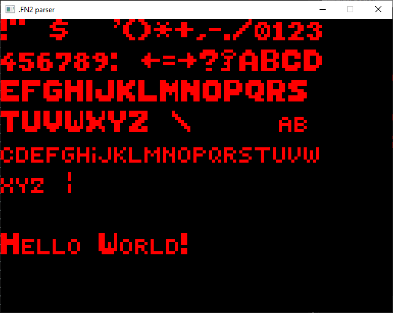

# .FN2 file parser

_Work-In-Progess!_

Parser for unknown .FN2 font file format found in original Ultimate Tapan Kaikki (`TK321.ZIP`). Parser doesn't parse color information from the file. The font file this parser was created for contains monochrome font so color support was not needed. Parser relies on magic offset tailored for this particular font file.

